# Deployment Workload 6: Dockerizing an E-Commerce Application  

- [PURPOSE](#purpose)
- [OBJECTIVES](#objectives)
- [STEPS And Why each was Necessary](#the-steps-taken-and-why-each-was-necessaryimportant)
- [SYSTEM DESIGN DIAGRAM](#system-design-diagram)
- [ISSUES and TROUBLESHOOTING](#issuestroubleshooting)
- [OPTIMIZATION](#optimization)
- [CONCLUSION](#conclusion)

## Purpose  
In this workload we used Docker to containerize our frontend and backend application. We used Jenkins to automate the process of creating a infrastructure and Terraform to create infrastructure through code.

---

## Objectives  
- Understand the benefits of containerization in a production environment.  
- Implement a multi-container setup using Docker Compose.  
- Build and deploy a scalable e-commerce application using Jenkins, Docker, and Terraform.  

---

## The "STEPS" taken (and why each was necessary/important)  

### 1. Repository Setup  
Save the repository as`ecommerce_docker_deployment`. This will serve as the foundation for building and deploying the application.  

### 2. Infrastructure Setup  
Use Terraform to create the following infrastructure:  
- **Custom VPC** in `us-east-1` with public and private subnets in two availability zones.  
- **EC2 Instances**:  
  - Bastion hosts in public subnets.  
  - Backend and frontend servers in private subnets.  
- **Load Balancer** to route traffic.  
- **RDS Database** for application storage.  

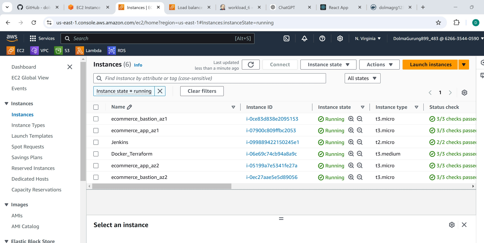
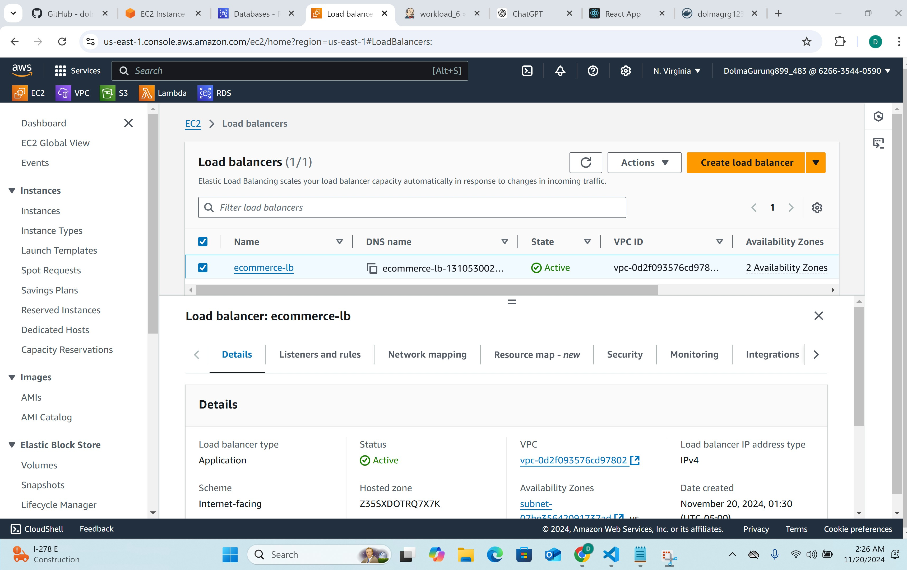
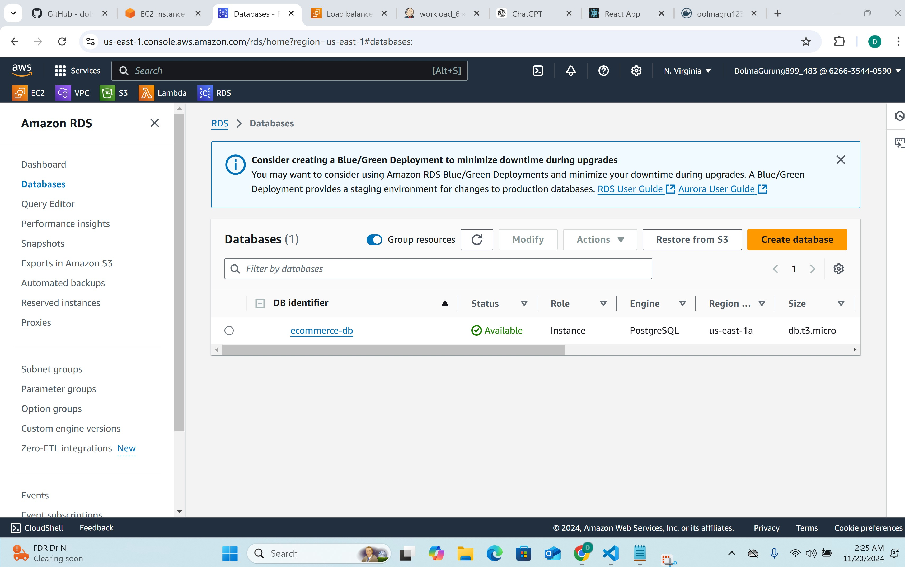
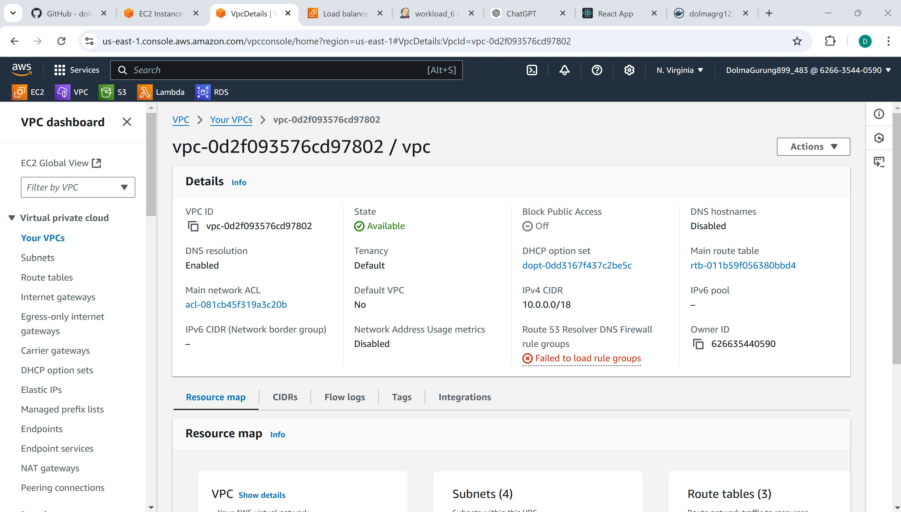
---

## Containerization  

### Backend Service  
- **Base Image**: Python 3.9.  
- **Key Steps**:  
  - Copy the backend application code.  
  - Install `django-environ` and other dependencies.  
  - Run database migrations for `account`, `payments`, and `product`.  
  - Expose port 8000 and set the command to run the Django server.  

### Frontend Service  
- **Base Image**: Node.js 14.  
- **Key Steps**:  
  - Copy the frontend application code.  
  - Install dependencies using `npm install`.  
  - Expose port 3000 and set the command to start the React app.  

Save the backend Dockerfile as `Dockerfile.backend` and the frontend Dockerfile as `Dockerfile.frontend`.  

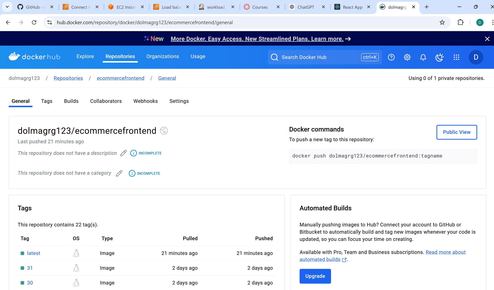
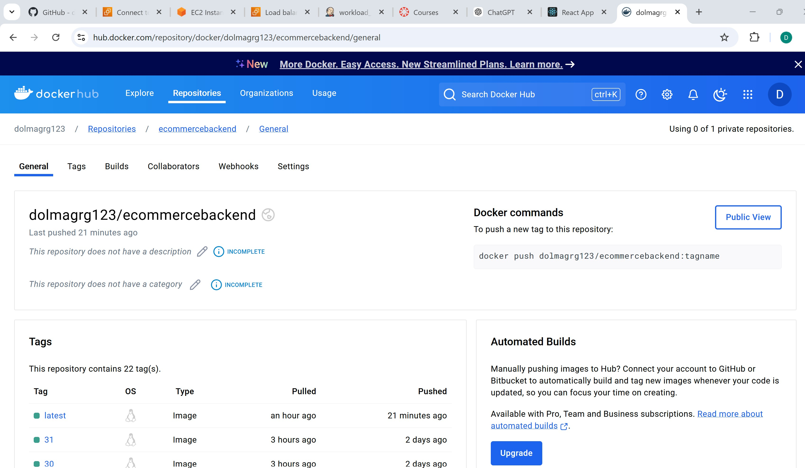
---

## Jenkins Setup  
- **Jenkins Manager EC2**: Install Jenkins and Java 17.  
- **Jenkins Node EC2**: Install Java 17, Terraform, Docker, and AWS CLI.  
- Configure a Jenkins Node Agent to connect the Manager and Node instances.  

---

## Deployment Automation  

### User Data Script (`deploy.sh`)  
- **Purpose**: Automates the setup of Docker, logging into DockerHub, and deploying the containers using Docker Compose.  
- **Steps**:  
  1. Install Docker and Docker Compose.  
  2. Log into DockerHub.  
  3. Generate and execute `docker-compose.yml`.  
  4. Pull and recreate Docker containers.  
  5. Clean up the server using `docker system prune`.  

### Docker Compose  
Modify the provided `compose.yml` to use the correct image tags for the backend and frontend services. 

---

## Monitoring  
Create an EC2 instance in the default VPC to monitor server resources. Configure Node Exporter to collect metrics for monitoring.  

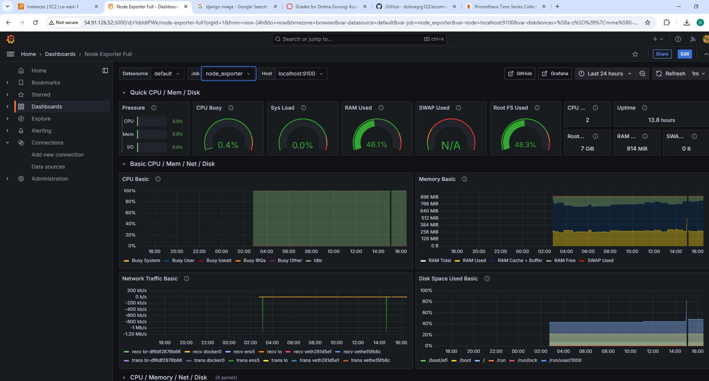
---

## Issues & Troubleshooting  
1. **Backend container not starting**: Resolved by updating the RDS endpoint in the environment configuration.  
2. **Data not loading from `entry.sh`**: Manually loaded data into the RDS instance. 

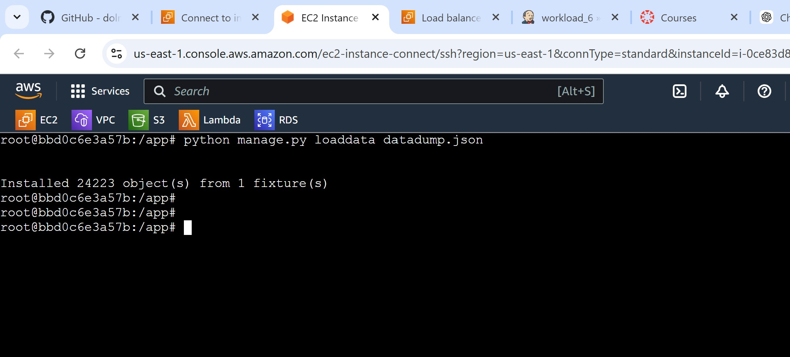

3. **User Data script not running**: Resolved by manually cloning the repository and running `deploy.sh` on the app server.  
4. **Var issue in dockercompose**: Updated the path to path.root to resolve.

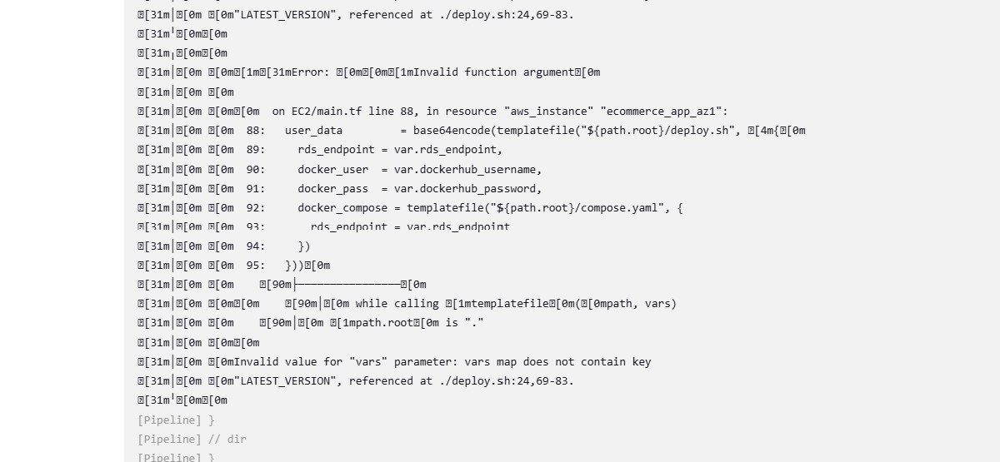

5. **Space issue in Jenkins node**: Updated the volume to 16GB

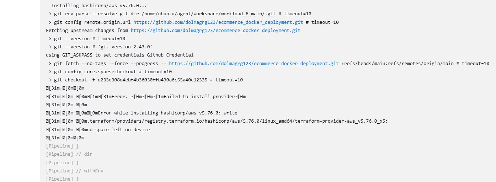

---

### "SYSTEM DESIGN DIAGRAM"

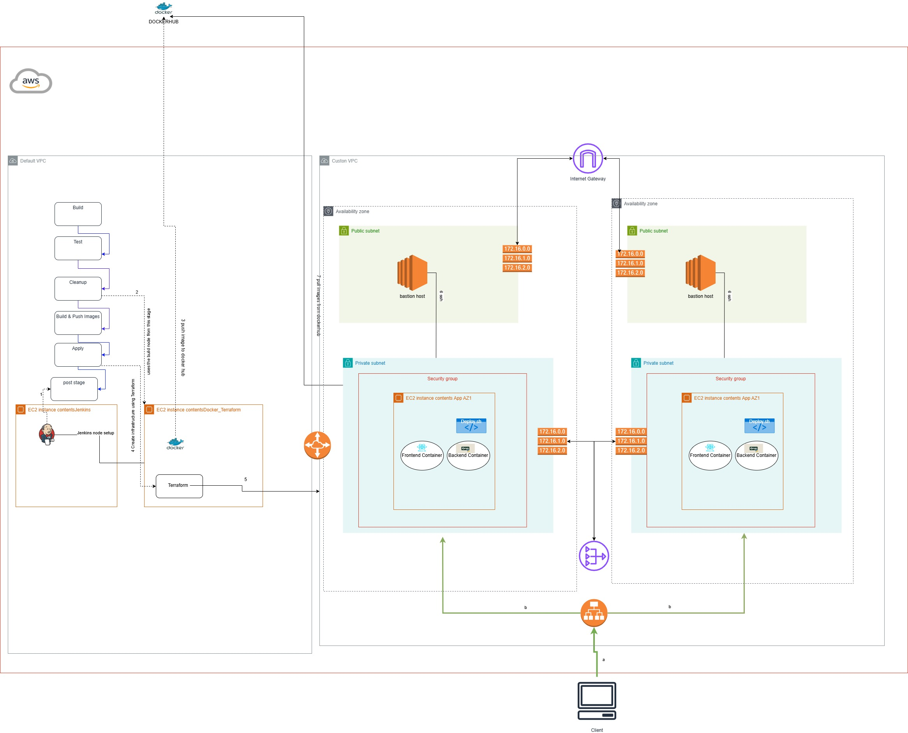

---

## Optimization Suggestions  
- Automate entire process to avoid manual tasks
- Use proper security groups to allow only traffic from necessary applications.

---

## Conclusion  
By leveraging Docker and Terraform, this workload demonstrates how to simplify and automate the deployment of a multi-container application. Through proper documentation and troubleshooting, the setup ensures a robust and scalable production environment.  
